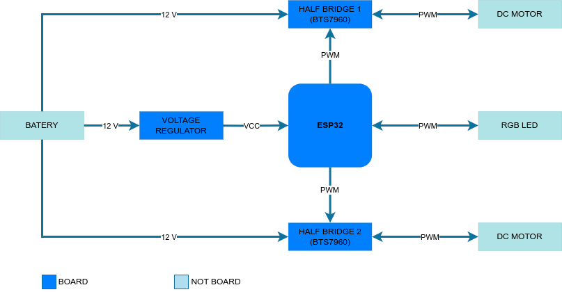

# Sumo robot

This project consists of creating a sumot robot using the Arduino IDE programming platform and the ESP32 board.  

## Block Diagram  



## How to run this project?  

Make sure you have the necessary packages installed on your computer to compile ESP32 scripts in the Arduino IDE. Check [Dependencies](#dependencies). Once this is done, simply send the code to the board with the following steps:

```bash
git clone git@gitlab.com:luiz_silva/robo-de-sumo.git
cd robo-de-sumo/main
```
Inside the main directory, open the project in the Arduino IDE or your preferred editor that can compile ESP32 code and run the main.ino project.

## Dependencies

You can follow this tutorial to install the libraries for PS3 control:
[Control your ESP32 projects with a PS3 controller!](https://github.com/jvpernis/esp32-ps3)

You can find an installation guide for ESP32 support in the Arduino IDE at the following link:
[ESP32 Arduino IDE Support Installation](https://docs.espressif.com/projects/arduino-esp32/en/latest/installing.html)


## References

[DroneBot Workshop - PS3 Control with ESP32](https://dronebotworkshop.com/ps3-esp32/)  
[Deep Blue Embedded - ESP32 PWM Tutorial](https://deepbluembedded.com/esp32-pwm-tutorial-examples-analogwrite-arduino/)
